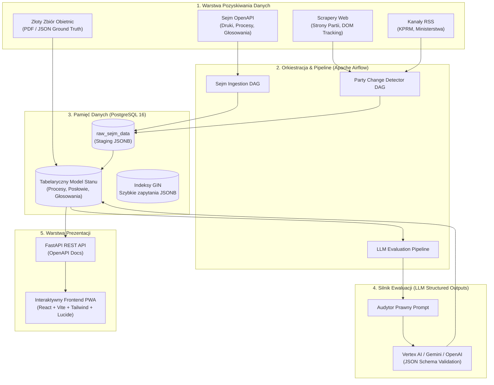

# 🇵🇱 Weryfikator Obietnic

> **Otwarty, bezstronny system analityczny rozliczania obietnic wyborczych oraz monitorowania prac legislacyjnych Sejmu RP napędzany przez Apache Airflow i modele LLM.**

[](https://github.com/FranekJemiolo/weryfikatorobietnic/actions/workflows/ci.yml)
[](https://FranekJemiolo.github.io/weryfikatorobietnic)
[](https://www.python.org/downloads/)
[](https://github.com/astral-sh/uv)
[](https://airflow.apache.org/)
[](https://www.postgresql.org/)
[](https://opensource.org/licenses/MIT)

🌐 **[Demo Landing Page → https://FranekJemiolo.github.io/weryfikatorobietnic](https://FranekJemiolo.github.io/weryfikatorobietnic)**

<p align="center">
  
</p>

---

## 1. 🎯 Wizja i Misja Projektu

Weryfikator Obietnic to projekt z obszaru **Civic Tech** (technologii obywatelskich), którego celem jest przywrócenie przejrzystości, rozliczalności i mierzalności w polskim procesie legislacyjnym.

### ⚖️ Zasada Bezstronności (Execution, Not Politics)
Projekt świadomie i kategorycznie **odcina się od oceniania, czy dane prawo jest „dobre” czy „złe”** w sensie ideologicznym lub politycznym. Oceny moralne i polityczne są domeną wyborców. System skupia się wyłącznie na **twardych metrykach wykonawczych (Execution Metrics)**:

1. **Zgodność (Alignment):** Na ile tekst procedowanego lub uchwalonego projektu ustawy faktycznie realizuje pierwotną obietnicę wyborczą danej partii?
2. **Czas Realizacji (Time-to-Delivery):** Ile dni minęło od złożenia obietnicy (lub powołania rządu) do:
   - pojawienia się projektu w Rządowym Procesie Legislacyjnym (RCL),
   - nadania druku sejmowego przez Marszałka Sejmu,
   - pierwszego czytania i prac w komisjach,
   - ostatecznego przegłosowania i podpisu Prezydenta.
3. **Odpowiedzialność Parlamentarzystów (Accountability):** Śledzenie imiennej frekwencji posłów oraz ich głosowań w odniesieniu do linii programowej własnego ugrupowania.
4. **Gospodarność Budżetowa (Budget Tracking):** Monitorowanie szacunków kosztów w Ocenie Skutków Regulacji (OSR) w porównaniu do deklarowanych limitów budżetowych.

---

## 2. 🏛️ Źródła Danych (Data Ingestion Layer)

System pobiera i normalizuje dane z czterech głównych strumieni:

1. **Sejm OpenAPI (`api.sejm.gov.pl`):**
   - Pełna baza procesów legislacyjnych X kadencji (`/processes`).
   - Teksty druków sejmowych, uzasadnienia oraz OSR (`/prints`).
   - Imienne protokoły każdego głosowania sejmowego (`/votings`).
   - Rejestr posłów i przynależności klubowej (`/MP`).
2. **Scrapery Webowe i RSS Partii Rządzących i Opozycyjnych:**
   - Codzienny nasłuch oficjalnych serwisów partii oraz biur prasowych KPRM i ministerstw.
   - Wykrywanie tzw. „cichych zmian” za pomocą sum kontrolnych SHA-256 z oczyszczonego drzewa DOM.
3. **Złoty Zbiór Obietnic (Ground Truth):**
   - Zaindeksowane programy wyborcze (np. deklaracje koalicyjne, „100 konkretów”) zunifikowane do formatu JSON Schema.
4. **Internetowy System Aktów Prawnych (ISAP) & RCL:**
   - Monitorowanie wczesnych etapów konsultacji międzyresortowych oraz publikacji w Dzienniku Ustaw i Monitorze Polskim.

---

## 3. 🏗️ Architektura Systemu

System zaprojektowano modułowo, dbając o separację ingestii, orkiestracji, przechowywania i serwowania danych.



---

## 4. 🗺️ Plan Implementacji (5 Faz)

Projekt realizowany jest w 5 ustrukturyzowanych etapach z nadzorem ludzkim (*Human-in-the-loop*):

### Faza 1: Fundamenty Projektu i Środowisko (Ukończona)
- [x] Utworzenie publicznego repozytorium GitHub: `FranekJemiolo/weryfikatorobietnic`.
- [x] Inicjalizacja środowiska za pomocą nowoczesnego menedżera pakietów **`uv`** (CPython 3.12 / 3.14).
- [x] Konfiguracja lokalnego środowiska **Docker Compose** (Apache Airflow 2.x + PostgreSQL 16 z obsługą JSONB).
- [x] Przygotowanie modularnej architektury (`/src`, `/dags`, `/tests`, `/docker`).
- [x] Skonfigurowanie narzędzi jakości kodu: **Ruff**, **Mypy (Strict)** oraz **Pytest**.

### Faza 2: Ingestia Danych Sejmowych (Sejm OpenAPI & Głosowania)
- [ ] Implementacja DAG-ów Airflow cyklicznie pobierających procesy legislacyjne (`/processes`) i druki (`/prints`).
- [ ] Mapowanie statusów spraw (Wpłynęło -> I czytanie -> Komisje -> Uchwalono -> Podpisano).
- [ ] Pobieranie protokołów posiedzeń i głosowań imiennych posłów (`/votings/{sitting}/{votingNum}`).
- [ ] Parsowanie i indeksowanie list obecności oraz głosowań w relacji do przynależności klubowej.

### Faza 3: Nasłuch Stron Partii i Śledzenie Modyfikacji
- [ ] Moduł crawlerów śledzących oficjalne witryny ugrupowań (BeautifulSoup).
- [ ] Oczyszczanie DOM z elementów dynamicznych (banery cookie, liczniki, nawigacja) i hashowanie SHA-256.
- [ ] Automatyczne alerty o wykryciu „cichych modyfikacji” w tekstach deklaracji programowych.

### Faza 4: Silnik Ewaluacji i Kategoryzacji LLM (Structured Outputs)
- [ ] Prompty analityczne działające w reżimie *Chain of Thought* i restrykcyjnego formatu JSON Schema.
- [ ] Porównywanie artykułów ustaw z obietnicami i kategoryzacja: `W_PELNI_ZREALIZOWANA`, `CZESCIOWO_ZREALIZOWANA`, `ZMIENIONA_KONCEPCJA`, `SPRZECZNA`.
- [ ] Generowanie bezstronnych, 2-3 zdaniowych podsumowań różnic dla obywatela oraz wyliczanie wskaźnika zgodności (`alignment_score` 0–100).
- [ ] Moduł wyliczania czasu: `Time-to-Delivery` (licznik dni od obietnicy/zaprzysiężenia rządu do głosowania).

### Faza 5: Frontend i Wizualizacja (Otwarty Panel Obywatelski)
- [ ] Budowa aplikacji **Progressive Web App (PWA)** opartej o nowoczesne narzędzia open-source.
- [ ] Wizualna oś czasu (Timeline) dla każdego procesu prawnego.
- [ ] Podstrona **„Weryfikuj Posła”** (frekwencja, dyscyplina klubowa, udział w kluczowych głosowaniach).
- [ ] Główny wskaźnik wykonania programu rządowego (*Overall Government Execution Score*).

---

## 5. 💻 Rekomendowany Stos Technologiczny dla UI (Open-Source)

Zgodnie z zasadą wykorzystywania najlepszych dostępnych darmowych i otwartoźródłowych technologii:

| Warstwa | Technologia | Zalety / Uzasadnienie |
| :--- | :--- | :--- |
| **Framework UI** | **React 18/19 + Vite + TypeScript** | Błyskawiczny build, pełne typowanie, zerowy narzut licencyjny, ogromny ekosystem. |
| **Styling & Design System** | **Tailwind CSS + Tailwind Typography** | Uniwersalny, lekki, w pełni responsywny system tokenów wizualnych. |
| **Komponenty Headless** | **Radix UI / Shadcn UI** | W 100% otwarte, dostępne (a11y), konfigurowalne bez zewnętrznych zależności SaaS. |
| **Ikony** | **Lucide Icons** | Nowoczesny, lekki zestaw wektorowy. |
| **Wykresy i Wizualizacje** | **Recharts / Tremor Open-Source** | Idealne do wykresów koalicji, osi czasu procesów i diagramów głosowań parlamentarnych. |
| **Aplikacja Mobilna** | **Vite PWA Plugin** | Aplikacja instalowalna na smartfonach i komputerach bez opłat sklepowych (App Store / Play Store). |
| **Warstwa API** | **FastAPI (Python)** | Asynchroniczna obsługa, natywna walidacja Pydantic, automatyczna dokumentacja Swagger/OpenAPI. |

---

## 6. 🚀 Szybki Start (Lokalne Uruchomienie)

### Wymagania wstępne
- Zainstalowany menedżer pakietów [**`uv`**](https://github.com/astral-sh/uv) (wersja >= 0.4.x).
- Zainstalowany **Docker** oraz **Docker Compose** (v2+).
- Python 3.12 lub 3.14.

### Krok 1: Klonowanie repozytorium
```bash
git clone https://github.com/FranekJemiolo/weryfikatorobietnic.git
cd weryfikatorobietnic
```

### Krok 2: Konfiguracja środowiska Python z `uv`
```bash
# Utworzenie wirtualnego środowiska opartego na najnowszym Pythonie
uv venv --python 3.14

# Aktywacja środowiska (opcjonalnie, uv potrafi uruchamiać polecenia bezpośrednio)
source .venv/bin/activate

# Instalacja zależności developerskich
uv pip install -e ".[dev]"
```

### Krok 3: Przygotowanie pliku `.env`
```bash
cp .env.example .env
# Uzupełnij ewentualne klucze API (np. GEMINI_API_KEY)
```

### Krok 4: Uruchomienie bazy danych i Apache Airflow
```bash
# Uruchomienie PostgreSQL, inicjalizacja bazy i start Airflow Webserver + Scheduler
docker compose up -d

# Sprawdzenie statusu kontenerów
docker compose ps
```

Dostęp do usług:
- **Airflow Webserver:** [http://localhost:8080](http://localhost:8080) (Login: `admin`, Hasło: `admin`)
- **PostgreSQL Database:** `localhost:5432` (Baza: `weryfikator_db`, Użytkownik: `airflow`, Hasło: `airflow`)

### Krok 5: Uruchomienie serwera FastAPI (opcjonalnie)
```bash
uv run uvicorn src.api:app --reload --port 8000
```
- **Interaktywna dokumentacja Swagger:** [http://localhost:8000/docs](http://localhost:8000/docs)

---

## 7. 🧪 Testy i Jakość Kodu

W projekcie rygorystycznie przestrzegamy standardów:
- **Ścisłe typowanie (Strict Type Hints)** dla wszystkich funkcji i modeli.
- **Docstringi** dokumentujące parametry i zwracane wartości.
- **Zasada pojedynczej odpowiedzialności (Single Responsibility)**.

```bash
# Uruchomienie testów jednostkowych
uv run pytest

# Weryfikacja formatowania i linter (Ruff)
uv run ruff check .

# Statyczna analiza typów (Mypy)
uv run mypy src/ tests/
```

---

## 8. 🤝 Udział w Projekcie (Contributing)

Projekt jest otwarty na wkład społeczności: programistów, prawników, analityków danych i dziennikarzy śledczych.
1. Sforkuj repozytorium.
2. Stwórz gałąź funkcyjną (`git checkout -b feature/nowy-kolektor`).
3. Zadbaj o testy jednostkowe i zgodność z `ruff` oraz `mypy`.
4. Otwórz Pull Request z opisem wprowadzanych zmian.

---

## 📄 Licencja

Projekt jest udostępniany na zasadach otwartej licencji **MIT**. Szczegóły w pliku `LICENSE`.
