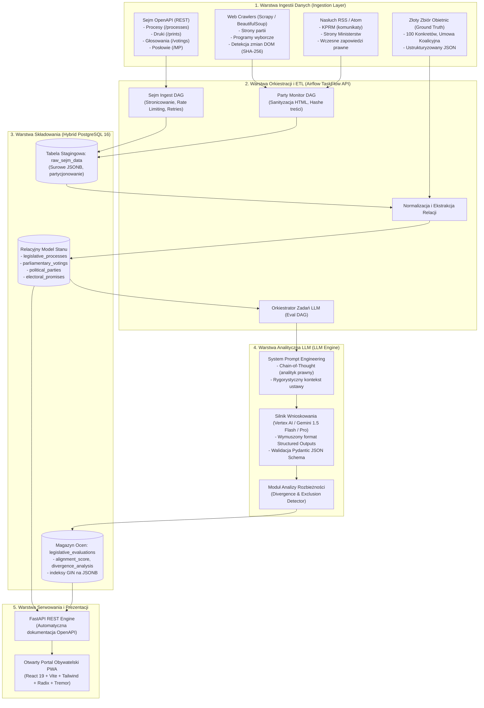

# 📐 Dokumentacja Architektoniczna i Wizja Systemu (VISION.md)

> **Projekt:** Weryfikator Obietnic  
> **Status:** Single Source of Truth (SSOT)  
> **Wersja:** 1.0.0  
> **Rola:** Architektura Systemu, Model Domenowy i Wytyczne Inżynieryjne  
> **Repozytorium:** [github.com/FranekJemiolo/weryfikatorobietnic](https://github.com/FranekJemiolo/weryfikatorobietnic)  

---

## 1. 🎯 WIZJA I CEL PROJEKTU (The Core Philosophy)

### 1.1. Kontekst Społeczno-Technologiczny
Współczesna debata publiczna w Polsce cierpi na chroniczny deficyt obiektywnej, faktograficznej weryfikacji działań władzy wykonawczej i ustawodawczej. Tradycyjny fact-checking jest procesem w przeważającej mierze manualnym, podatnym na subiektywizm redaktorski, selektywny dobór spraw oraz ograniczenia przepustowości ludzkich analityków. W efekcie obywatele nie posiadają całościowego, bieżącego obrazu stopnia realizacji programów wyborczych.

**Weryfikator Obietnic** to otwartoźródłowy (open-source) system inżynierii danych i sztucznej inteligencji z segmentu **Civic Tech**. Jego misją jest stworzenie w pełni zautomatyzowanego, transparentnego i mierzalnego aparatu analitycznego do ciągłego monitorowania prac legislacyjnych Sejmu RP oraz konfrontowania ich ze złożonymi obietnicami wyborczymi.

### 1.2. Zasada Ścisłej Bezstronności (Execution, Not Politics)
System opiera się na fundamencie aksjologicznym definiowanym jako **„Rozliczanie Wykonawcze, a nie Ideologiczne”**:
* **Brak ocen aksjologicznych:** System **nie ocenia**, czy projekt ustawy jest „dobry”, „zły”, „potrzebny” czy „szkodliwy”. Takie oceny stanowią nienaruszalną domenę indywidualnych wyborców i suwerena.
* **Twarde Metryki Wykonawcze (Execution Metrics):** Ewaluacja ogranicza się wyłącznie do matematycznych i logicznych wskaźników realizacji:

| Wskaźnik | Definicja operacyjna | Metoda pomiaru |
| :--- | :--- | :--- |
| **Zgodność (Alignment)** | Stopień, w jakim zapisy wniesionego/uchwalonego projektu realizują pierwotne postulaty programowe. | Modele LLM z restrykcyjnym JSON Schema (0–100 pkt, status kategoryczny). |
| **Czas Realizacji (Time-to-Delivery)** | Dokładna liczba dni upływająca pomiędzy złożeniem obietnicy (lub powołaniem rządu) a poszczególnymi etapami ścieżki legislacyjnej. | Różnice sygnatur czasowych (Timestamps) z Sejm OpenAPI i RCL. |
| **Gospodarność (Budget Tracking)** | Zestawienie szacunków kosztów zawartych w Ocenie Skutków Regulacji (OSR) z deklarowanymi limitami budżetowymi obietnic. | Parsowanie metryk liczbowych i tabel OSR z druków sejmowych. |
| **Odpowiedzialność (Accountability)** | Analiza zachowań parlamentarzystów – frekwencja na posiedzeniach oraz zgodność głosowań z oficjalnym programem ich ugrupowania. | Imienna agregacja protokołów głosowań sejmowych z bazy `api.sejm.gov.pl`. |

---

## 2. 🏛️ ARCHITEKTURA SYSTEMU (The Pipeline)

Architektura systemu została zaprojektowana w modelu 4-warstwowym (warstwy: ingestii, orkiestracji, składowania i analityki LLM), zakończonym warstwą udostępniania danych (FastAPI / Frontend PWA).



### 2.1. Szczegółowy opis warstw

#### Warstwa 1: Ingestia Danych (Data Ingestion)
* **Sejm OpenAPI:** Pobieranie pełnej historii spraw legislacyjnych, załączników PDF (uzasadnienia, OSR) oraz imiennych list głosowań. Zapytania wykonują operacje inkrementalne z uwzględnieniem `offset` i `limit` oraz nagłówków etag/cache.
* **Scrapery witryn politycznych:** Regularny monitoring oficjalnych portali partii rządzących i opozycyjnych. Każdy artykuł programowy jest poddawany stripowaniu tagów dynamicznych (cookies, skrypty, liczniki, stopki), a następnie hashowany algorytmem SHA-256. Modyfikacja hasha wyzwala zapis rewizji (wykrywanie tzw. „cichych nowelizacji” obietnic).
* **Kanały RSS:** Asynchroniczny nasłuch komunikatów Centrum Informacyjnego Rządu (CIR) i ministerstw, wyłapujący wczesne zamiary legislacyjne przed nadaniem oficjalnego druku sejmowego.

#### Warstwa 2: Orkiestracja i ETL (Apache Airflow TaskFlow API)
* Wykorzystanie dekoratorów `@dag` i `@task` zapewniających silne typowanie przepływów XCom.
* Wbudowane mechanizmy *exponential backoff* i *retries* w przypadku przeciążeń publicznych serwerów rządowych.
* Architektura idempotentna – ponowne uruchomienie DAG-a z tą samą datą logiczną nie duplikuje rekordów.

#### Warstwa 3: Składowanie (PostgreSQL 16 – Model Hybrydowy)
* **Podwójna rola PostgreSQL:** Baza łączy cechy relacyjnego magazynu stanu (klucze obce, integralność referencyjna dla partii, posłów i kadencji) oraz magazynu dokumentowego (kolumny `JSONB` z indeksami `GIN`).
* **Warstwa Stagingowa (`raw_sejm_data`):** Zapisuje surowe payloady JSON prosto z API, tworząc audytowalny, niezmienny rejestr źródłowy (*Raw Data Lake*).

#### Warstwa 4: Analityka i Ewaluacja LLM (LLM Engine)
* Wykorzystanie natywnego mechanizmu **Structured Outputs** (JSON Schema), eliminującego ryzyko halucynacji formatu tekstu.
* Analiza porównawcza prowadzona jest w trybie bezstronnego biegłego legislacyjnego:
  1. Ekstrakcja kluczowych dyspozycji projektu ustawy.
  2. Zestawienie z parametrami obietnicy (grupa docelowa, limit finansowy, termin).
  3. Wykrycie wyłączeń i rozbieżności (*Divergence Analysis*).
  4. Wyliczenie punktacji `alignment_score` (0–100) i przypisanie statusu kategorycznego.

---

## 3. 🛠️ STOS TECHNOLOGICZNY (Tech Stack)

Wybór technologii podyktowany jest wydajnością, stabilnością ekosystemu oraz darmowym/otwartym charakterem komponentów:

| Komponent | Wybrana technologia | Uzasadnienie inżynieryjne |
| :--- | :--- | :--- |
| **Język podstawowy** | **Python 3.12+ (CPython 3.14)** | Najnowsze optymalizacje wydajnościowe interpretera, wbudowany `StrEnum`, zaawansowane wsparcie dla typowania statycznego. |
| **Package & Env Manager** | **`uv` (Astral)** | Zastępuje powolne menedżery (Poetry/Pipenv). Umożliwia instalację zależności w milisekundach, posiada deterministyczny `uv.lock` i natywną obsługę PEP 621 (`pyproject.toml`). |
| **Orkiestracja ETL** | **Apache Airflow 2.9+** | Branżowy standard orkiestracji danych, wsparcie dla TaskFlow API, czytelna wizualizacja zależności i harmonogramów w UI. |
| **Baza danych** | **PostgreSQL 16** | Obsługa typów `JSONB`, indeksy GIN do zapytań w głąb dokumentów, transakcyjność ACID, rozszerzenia `uuid-ossp` i `unaccent`. |
| **Sterownik DB** | **`psycopg` (v3)** | Asynchroniczny i synchroniczny nowoczesny sterownik PostgreSQL z natywną adaptacją typów JSONB bez narzutu ORM. |
| **Walidacja schematów** | **Pydantic v2** | Silnik walidacji w Rust (pydantic-core), generowanie JSON Schema dla Structured Outputs w modelach LLM. |
| **Scraping & DOM** | **BeautifulSoup4 & Requests / Scrapy** | Precyzyjne usuwanie szumu z HTML, pobieranie zawartości i deterministyczne generowanie sum kontrolnych. |
| **Serwowanie API** | **FastAPI + Uvicorn** | Ekstremalnie szybkie, asynchroniczne REST API z automatyczną generacją interfejsu OpenAPI / Swagger. |
| **Linter & Typowanie** | **Ruff & Mypy (Strict)** | Natychmiastowy linter/formatter w Rust (Ruff) oraz bezkompromisowa statyczna weryfikacja typów w trybie strict. |
| **Warstwa UI** | **React 19 + TypeScript + Vite + Tailwind CSS** | Zero opłat licencyjnych, komponenty Radix/Shadcn, wizualizacje Recharts/Tremor, wsparcie dla PWA (instalacja na telefonach bez pośrednictwa App Store / Google Play). |

---

## 4. 🔄 CYKL ŻYCIA DANYCH (Data Lifecycle)

Każda obietnica wyborcza oraz akt prawny przechodzą rygorystyczny proces przetwarzania:

```
[Etap 1: Inicjalizacja Obietnicy]
              │
              ▼
    Program Wyborczy (PDF/Web) ──> Parser Ground Truth ──> electoral_promises (PostgreSQL)
                                                                 │
                                                                 │ (oczekiwanie na proces)
[Etap 2: Detekcja Procesu w Sejmie]                              │
              │                                                  │
              ▼                                                  │
    Sejm OpenAPI (/processes) ──> Ingest DAG ──> raw_sejm_data   │
              │                                      │           │
              ▼                                      ▼           │
    Ekstrakcja Druku (/prints) ──> legislative_processes (Stan)  │
              │                                      │           │
              ▼                                      ▼           │
[Etap 3: Ewaluacja LLM i Diff]                       │           │
              ├──────────────────────────────────────┴───────────┤
              ▼
    LLM Prompt (Tekst Ustawy + Założenia Obietnicy)
              │
              ▼
    Structured Output (JSON Schema: alignment_score, divergence_analysis)
              │
              ▼
    Zapis do: legislative_evaluations
              │
              ▼
[Etap 4: Śledzenie Głosowania i Czasu]
    Sejm OpenAPI (/votings) ──> parliamentary_votings (Kto jak głosował)
              │
              ▼
    Obliczenie Time-to-Delivery: Data Ustawy minus Data Obietnicy
              │
              ▼
[Etap 5: Udostępnienie i Wizualizacja]
    FastAPI Endpoints ──> Dashboard Obywatelski PWA (Timeline, Scorecard, Profil Posła)
```

1. **Ingestia Obietnicy:** Wprowadzenie rekordu do Złotej Bazy (`electoral_promises`) z przypisaniem unikalnego identyfikatora (np. `KO-100K-042`), kategorii, tekstu pierwotnego oraz metryk mierzalnych (np. kwota 60 000 PLN).
2. **Nasłuch Sejmowy:** DAG Airflow odpytuje endpoint `/processes`. W przypadku wykrycia nowego druku pobiera jego treść, uzasadnienie oraz OSR, zapisując surowy obiekt do `raw_sejm_data` i tworząc wpis w `legislative_processes`.
3. **Ewaluacja Algorytmiczna (LLM):** Model analizuje powiązanie pomiędzy drukiem sejmowym a obietnicą. Weryfikuje:
   - Czy projekt dotyczy tej samej materii?
   - Jakie wprowadzono progi, wyłączenia lub przesunięcia terminów?
   - Jaki jest szacowany koszt regulacji?
   Wynik zapisywany jest w tabeli `legislative_evaluations`.
4. **Rozliczenie Głosowania:** W momencie zarządzenia głosowania w Sejmie, pipeline pobiera imienny rozkład głosów każdego posła. Sprawdzana jest spójność posłów partii obiecującej (kto poparł projekt, kto był przeciw, kto zerwał kworum).
5. **Prezentacja Obywatelska:** Obliczenie ostatecznego wskaźnika czasu (`time_to_delivery_days`) i zaktualizowanie publicznego endpointu API.

---

## 5. 🗺️ ROADMAPA WDROŻENIOWA (Implementation Roadmap)

Projekt podzielony jest na 5 logicznych, sekwencyjnych faz:

### Faza 1: Fundamenty Infrastruktury i Narzędziowni (Ukończona)
* Inicjalizacja publicznego repozytorium GitHub `FranekJemiolo/weryfikatorobietnic`.
* Konfiguracja środowiska w oparciu o menedżer pakietów **`uv`** i CPython 3.14 / 3.12+.
* Utworzenie `docker-compose.yml` (Apache Airflow 2.9 + PostgreSQL 16 z rozszerzeniami JSONB).
* Przygotowanie skryptu `init_db.sql` definiującego schemat tabel i indeksy GIN.
* Konfiguracja standardów jakości kodu (Ruff, Mypy w trybie strict, Pytest).

### Faza 2: Moduł Sejmowy (Ingestia OpenAPI & Głosowania)
* Implementacja produkcyjnego klienta Sejm OpenAPI w `src/collectors/sejm_api.py`.
* Budowa DAG-a Airflow pobierającego procesy legislacyjne, druki i powiązania z komisjami.
* Budowa kolektora wyników głosowań imiennych posłów i frekwencji.
* Testy integracyjne z mockowanym oraz produkcyjnym API Sejmu.

### Faza 3: Moduł Nasłuchu Zmian Programowych (Web & RSS Scrapers)
* Implementacja modułu `WebContentTracker` w oparciu o BeautifulSoup i Scrapy.
* Przygotowanie listy crawlerów dla głównych partii politycznych (KO, PSL, Polska 2050, Lewica, PiS, Konfederacja).
* Wdrożenie automatycznego algorytmu detekcji i wersjonowania zmian w obietnicach (SHA-256 DOM hash diffing).
* Budowa konektorów do kanałów RSS KPRM i ministerstw.

### Faza 4: Silnik Ewaluacji i Kategoryzacji LLM
* Opracowanie i walidacja promptów systemowych dla bezstronnego analityka prawnego.
* Integracja z Google Vertex AI (Gemini 1.5 Flash / Pro) z wymuszoną walidacją Pydantic JSON Schema.
* Implementacja logiki wyliczania metryki `Time-to-Delivery` (licznik dni).
* Moduł OSR Parser do wyciągania deklarowanych skutków finansowych z druków sejmowych.

### Faza 5: Serwowanie Danych i Frontend Obywatelski (PWA)
* Rozbudowa API w FastAPI o zaawansowane filtry, paginację i statystyki rządu.
* Stworzenie nowoczesnej aplikacji PWA (React 19 + TypeScript + Vite + Tailwind CSS + Radix UI + Tremor).
* Implementacja interaktywnej osi czasu procesów legislacyjnych.
* Moduł **„Sprawdź Posła”** (wyszukiwarka parlamentarzysty, statystyka obecności i głosowań).
* Wdrożenie w architekturze chmurowej (np. Cloud Run / Composer w Google Cloud) z nadzorem ludzkim.

---

## 6. 📜 REGUŁY JAKOŚCI I WSPÓŁPRACY (Engineering Guidelines)

Wszyscy kontrybutorzy oraz agenci automatyczni generujący kod dla repozytorium są bezwzględnie zobowiązani do przestrzegania poniższych zasad:
1. **Strict Typing:** Każda sygnatura funkcji, metody i modelu musi posiadać pełne adnotacje typów (`typing`, `str | None`). Brak jakiegokolwiek typu kwalifikuje kod do odrzucenia przez Mypy.
2. **Samodzielna Odpowiedzialność (SRP):** Kod domenowy, parsery i logika pobierania danych znajdują się wyłącznie w `/src`. Pliki w `/dags` definiują wyłącznie przepływ orkiestracji (zadania, zależności `>>`, harmonogram).
3. **Dokumentacja (Docstrings):** Każda klasa i metoda publiczna musi posiadać docstring w formacie Google lub Sphinx, wyjaśniający cel, argumenty (`Args:`) oraz zwracaną wartość (`Returns:`).
4. **Idempotentność Danych:** Operacje zapisu do bazy danych muszą być idempotentne (wykorzystywanie klauzul `ON CONFLICT DO UPDATE / NOTHING`).
