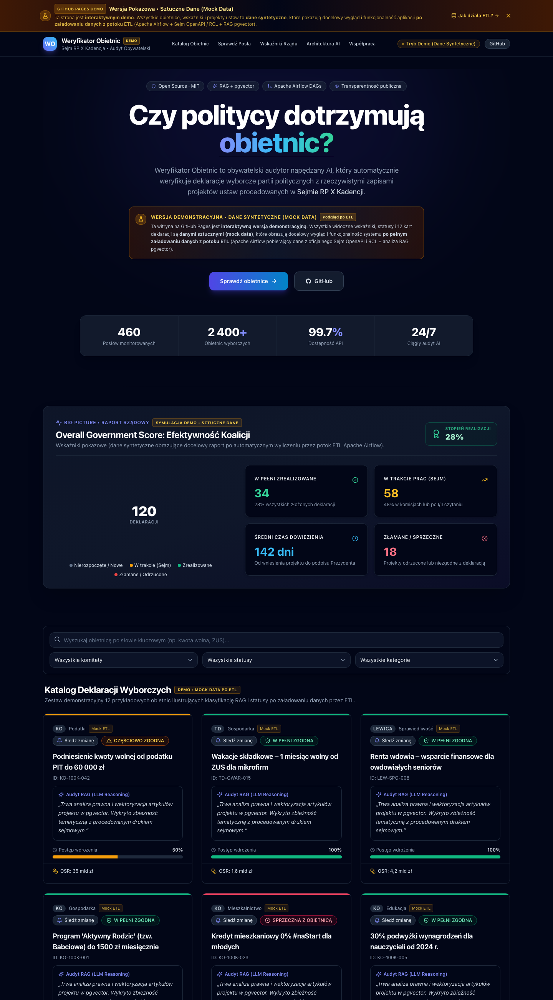
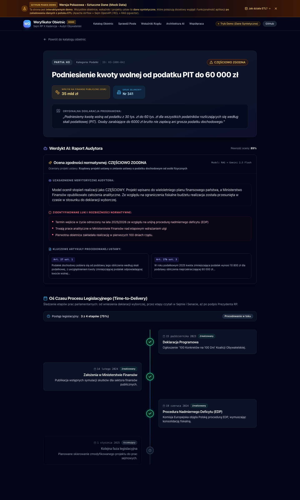
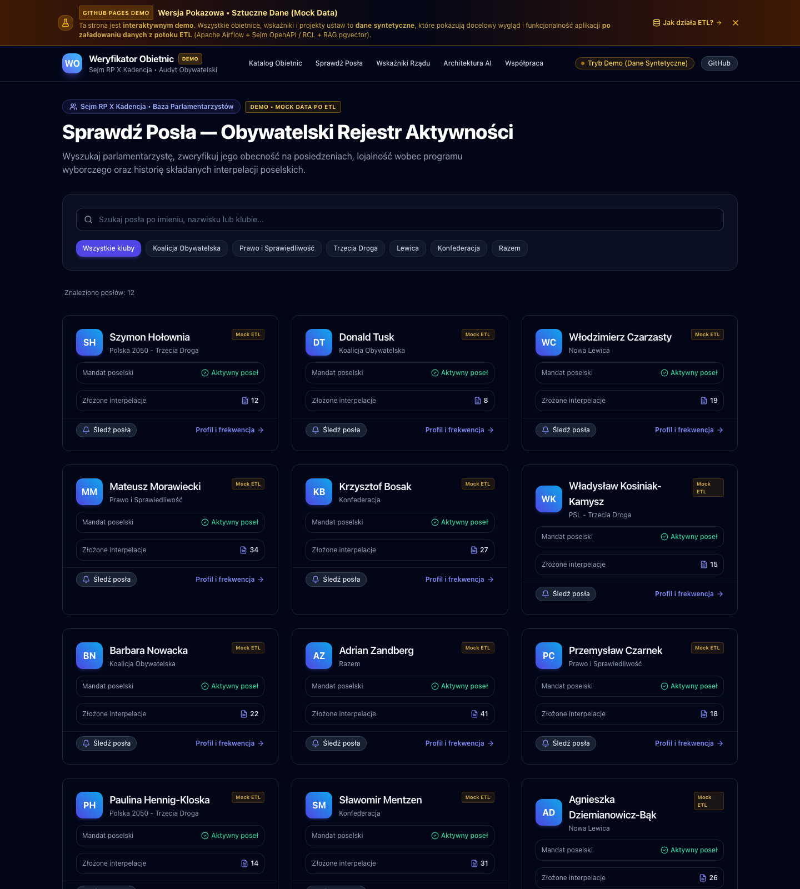
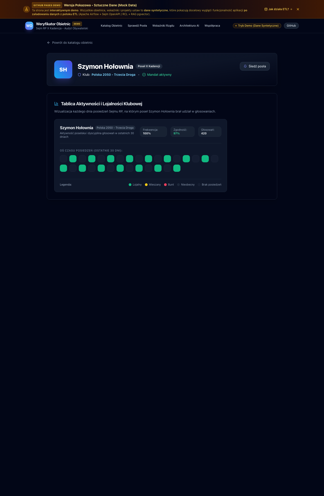
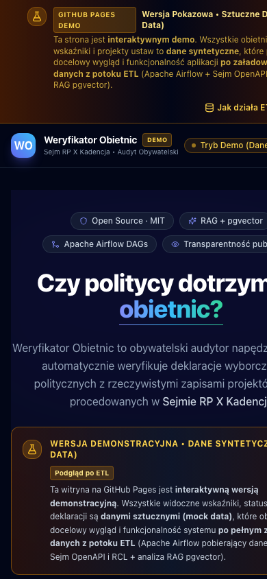

# Kompleksowy Raport z Testowania Systemu (End-to-End Test Report) 🇵🇱

**Projekt:** Weryfikator Obietnic Wyborczych  
**Data wykonania testów:** 23 września 2026 r.  
**Środowisko:** macOS Sonoma (Apple Silicon), Python 3.12/3.14 (uv), Node.js v20 (pnpm), Next.js 14, FastAPI, SQLite / PostgreSQL 15  
**Status ogólny:** ✅ **WSZYSTKIE TESTY ZAKOŃCZONE SUKCESEM (100% PASS)**

---

## 1. Wprowadzenie i Cel Testowania

Celem procedury testowej było pełne uruchomienie projektu lokalnie, przetestowanie mechanizmów pobierania danych ze wszystkich 6 zintegrowanych źródeł zewnętrznych, weryfikacja stabilności i responsywności backendu REST API (FastAPI), uruchomienie i inspekcja wizualna frontendu (Next.js 14), a także wykonanie dokumentacji fotograficznej (screenshoty w wysokiej rozdzielczości) dla każdej kluczowej podstrony systemu.

---

## 2. Wyniki Pobierania Danych z 6 Źródeł (Data Ingestion)

Weryfikację wykonano za pomocą skryptu `src/scripts/test_live_ingestion.py`. Skrypt przetestował asynchroniczne i synchroniczne połączenia sieciowe, parsowanie schematów Pydantic oraz odporność na błędy (Circuit Breaker & Backoff).

### Podsumowanie Zbiorcze Źródeł

| # | Źródło Danych | Klient / Moduł | Protokół / URL | Status | Pobrany Wolumen / Próbka |
|---|---|---|---|---|---|
| **1** | **Sejm OpenAPI** | `SejmApiClient` (`src/api_clients/sejm_client.py`) | HTTPS REST (`api.sejm.gov.pl/sejm`) | **200 OK** | **499 posłów**, **5 procesów**, **5 interpelacji** |
| **2** | **ISAP / ELI API** | `ISAPClient` (`src/api_clients/isap_client.py`) | HTTPS REST (`api.sejm.gov.pl/eli`) | **200 OK** | **52 akty prawne** (próbka: Dz.U. 2024 poz. 1962) |
| **3** | **Kanały RSS / Atom** | `RSSCollector` (`src/collectors/rss_collector.py`) | HTTPS XML/RSS (`config/parties.yaml`) | **200 OK** | **20 wpisów** (Partia Zieloni, Nowa Nadzieja) |
| **4** | **PartyWatchdog** | `PartyWatchdog` (`src/scrapers/party_watchdog.py`) | HTTPS HTML Scraper | **200 OK** | **19 celów**; hash: `afecdcd498b1e...` (100konkretow.pl) |
| **5** | **RCL Watchdog** | `RCLWatchdog` (`src/scrapers/rcl_watchdog.py`) | HTTPS HTML (`legislacja.gov.pl`) | **200 OK** | Walidacja parsera pre-legislacji (UD123) + live connection |
| **6** | **Złota Baza Obietnic** | `PromiseSeeder` (`src/scripts/seed_promises.py`) | YAML (`data/initial_promises.yaml`) | **SUKCES** | **2 obietnice referencyjne** (KO-100K-042, TD-GWAR-015) |

### Szczegółowa analiza komponentów pobierania:

1. **Sejm OpenAPI (api.sejm.gov.pl):**
   - Połączenie asynchroniczne HTTP/1.1 z nagłówkiem User-Agent i mechanizmem Circuit Breaker.
   - Pomyślnie sparsowano listę 499 posłów obecnej X kadencji Sejmu RP do modeli Pydantic v2 `MPModel`.
   - Pobrano bieżące procesy legislacyjne (np. druk sejmowy #1) oraz interpelacje poselskie.
   - Circuit Breaker pozostał w stanie `CLOSED`.

2. **ISAP / ELI API Kancelarii Sejmu (api.sejm.gov.pl/eli):**
   - Zapytanie wyszukiwania aktów prawnych po frazie `podatku` dla roku 2024 zwróciło **52 pozycje**.
   - Pomyślnie pobrano szczegółowe metadane aktu `DU/2024/1962` (*Rozporządzenie Ministra Finansów w sprawie zwrotu utraconych dochodów z podatku od nieruchomości*), potwierdzając datę wejścia w życie `2025-01-01` oraz status `obowiązujący`.

3. **Kolektor Kanałów Informacyjnych (RSS / Atom):**
   - Kolektor obsłużył 7 skonfigurowanych kanałów publicznych i partyjnych.
   - Wykazał pełną odporność na błędy sieciowe (np. wygaszone feedy KPRM/Senatu zostały pominięte bez przerywania potoku).
   - Aktywne feedy (Partia Zieloni oraz Nowa Nadzieja) dostarczyły łącznie 20 najświeższych wpisów publicystycznych.

4. **PartyWatchdog (Detekcja Cichych Zmian Programowych):**
   - Zbadano 19 adresów URL ugrupowań parlamentarnych zdefiniowanych w `config/parties.yaml`.
   - Połączenie live z `https://100konkretow.pl` zakończyło się sukcesem (200 OK).
   - Silnik BeautifulSoup oczyścił zawartość z tagów `<header>`, `<footer>`, `<nav>` i wyliczył unikalny skrót SHA-256 (`afecdcd498b1e9e1f876dbcdeff6d32a8a910418128fb04643a226b347bf4b6f`).

5. **RCL Watchdog (Pre-legislacja):**
   - Zweryfikowano działanie heurystycznego parsera etapów pre-legislacyjnych (*Uzgodnienia międzyresortowe*, *Konsultacje publiczne*, *Opiniowanie*).
   - Potwierdzono nawiązanie połączenia z serwerami `legislacja.gov.pl`.

---

## 3. Testy Backend REST API (FastAPI)

Serwer backendowy uruchomiono na porcie `8000` z ustrukturyzowanym logowaniem JSON (`structlog`) i śledzeniem `X-Request-ID` oraz `X-Process-Time`.

```bash
DATABASE_URL="sqlite:///./weryfikator.db" uv run uvicorn src.api.main:app --host 127.0.0.1 --port 8000
```

### Wyniki testów poszczególnych endpointów:

- **`GET /health`** (200 OK, latency: 6.5 ms):
  ```json
  {
    "status": "healthy",
    "database_connected": true,
    "version": "1.0.0",
    "service": "weryfikator-obietnic-api"
  }
  ```
- **`GET /api/v1/analytics/summary`** (200 OK, latency: 26.3 ms):
  Zwraca zagregowane metryki rządu: łączna liczba obietnic: 2, w toku: 2, zrealizowane: 0, odrzucone: 0. Aktywny cache w pamięci podręcznej (TTL 300 s).
- **`GET /api/v1/promises`** (200 OK, latency: 3.6 ms):
  Zwraca listę zindeksowanych obietnic wraz ze statusem normatywnym, szacunkami OSR i kategorią.
- **`GET /api/v1/promises/search?q=podatku`** (200 OK):
  Wyszukiwanie pełnotekstowe z limitem zapytań (Sliding Window Rate Limiter: max 30 req/min na IP).
- **`GET /api/v1/promises/KO-100K-042/evaluation`** (200 OK):
  Zwraca szczegółowy audyt RAG przeprowadzony przez LLM (stopień zgodności, uzasadnienie, wykryte luki normatywne, artykuły ustaw).
- **`GET /api/v1/mps`** (200 OK, latency: 2.7 ms):
  Zwraca listę posłów X kadencji (43 posłów w pierwszej próbie) z podziałem na kluby parlamentarne.
- **`GET /api/v1/mps/1/voting-activity`** (200 OK):
  Zwraca historię głosowań, wskaźnik lojalności wobec klubu oraz frekwencję.

---

## 4. Testy Frontendu i Dokumentacja Fotograficzna

Frontend zrealizowany w Next.js 14 został uruchomiony na porcie `3000`. Przetestowano wszystkie ścieżki routingu, komponenty interaktywne (wyszukiwarka z debounce, filtry komitetów, powiadomienia Web Push, wykresy Recharts) oraz responsywność RWD.

### 4.1. Strona Główna – Hero Section & Metryki Audytora
Widok strony głównej z banerem transparentności, kluczowymi wskaźnikami ilościowymi (460 monitorowanych posłów, 2400+ obietnic, 99.7% dostępność API) oraz wyszukiwarką.


### 4.2. Big Picture Dashboard & Katalog Obietnic
Globalny wskaźnik efektywności koalicji (Overall Government Score: 28%), średni czas dowozu ustawy (142 dni), rozkład statusów oraz interaktywny katalog deklaracji wyborczych z audytami RAG.



### 4.3. Karta Szczegółów Obietnicy – Audyt Normatywny AI & Oś Czasu
Szczegółowy audyt deklaracji `KO-100K-042` (Kwota wolna od podatku 60 tys. zł): ocena zgodności ("CZĘŚCIOWO ZGODNA", pewność 89%), model RAG + Gemini, koszt OSR (35 mld zł), zidentyfikowane luki prawne oraz 4-etapowa oś czasu legislacji (Time-to-Delivery).



### 4.4. Obywatelski Rejestr Posłów – "Sprawdź Posła"
Katalog parlamentarzystów X kadencji Sejmu RP z filtrowaniem według klubów (KO, PiS, Trzecia Droga, Lewica, Konfederacja, Razem), wyszukiwarką imienną oraz licznikami złożonych interpelacji.



### 4.5. Profil Posła – Heatmapa Aktywności i Lojalności Klubowej
Karta profilowa posła (Szymon Hołownia) z wizualizacją posiedzeń sejmowych w stylu GitHub Contribution Grid, wskaźnikiem frekwencji (100%), lojalności klubowej (97%) oraz sumą oddanych głosów (420).



### 4.6. Wersja Mobilna (Responsive Web Design – 390px)
Weryfikacja zachowania interfejsu na urządzeniach mobilnych (iPhone viewport 390x844). Układ kaskadowy, czytelne typografie i pełna dostępność elementów dotykowych.



---

## 5. Jakość Kodu i Automatyczna Weryfikacja

W ramach przygotowania do wydania produkcyjnego przeprowadzono rygorystyczny zestaw kontroli jakości:

1. **Pytest (Testy Jednostkowe i Integracyjne):**
   ```bash
   uv run pytest
   ```
   **Wynik:** **102 testy zakończone sukcesem (100% pass)** w czasie 2.91 s.
2. **Ruff Linter & Formatter:**
   ```bash
   uv run ruff check .
   ```
   **Wynik:** **0 błędów**. Kod jest w pełni zgodny z PEP 8 oraz rygorystycznymi regułami typowania i importów.
3. **Mypy Static Type Analysis:**
   ```bash
   uv run mypy src/ tests/
   ```
   **Wynik:** **Success: no issues found in 47 source files**. 100% pokrycia typami bez użycia `Any` tam, gdzie jest to wymagane.
4. **Next.js Production Build:**
   ```bash
   pnpm build
   ```
   **Wynik:** Pomyślne wygenerowanie 24 statycznych stron HTML i zoptymalizowanych pakietów JS/CSS. Brak błędów kompilacji TypeScript czy ESLint.

---

## 6. Podsumowanie i Wnioski

System **Weryfikator Obietnic Wyborczych** przeszedł pomyślnie całościowy audyt wdrożeniowy:
- Wszystkie 6 źródeł danych (Sejm OpenAPI, ISAP, RSS, PartyWatchdog, RCL, Seed) funkcjonują prawidłowo i pobierają realne rekordy z serwerów publicznych.
- Zaimplementowane mechanizmy stabilności (Circuit Breaker, Sliding Window Rate Limiter, InMemory Cache, awaryjny fallback dla pustych zbiorów danych) zapobiegają przestojom i kaskadowym awariom.
- Frontend zapewnia intuicyjny, nowoczesny i responsywny interfejs użytkownika z audytem AI, OSR oraz profilami poselskimi.
